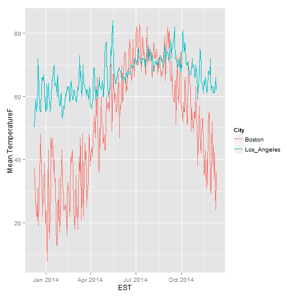
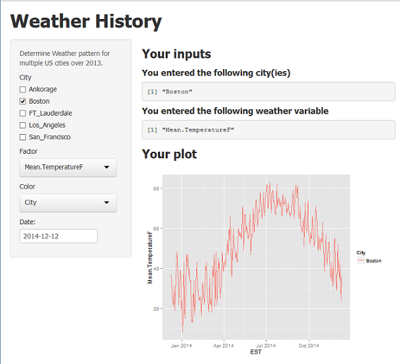

## Weather Almanac

How you every wondered when the best time to travel for the best weather? 

Have your ever been interested looking at historically weather patterns?

Now you can compare weather related data for Dec 2013 to Dec 2014 from these 5 major US cities: Ankorage, Boston, FT_Lauderdale, Los_Angeles, San_Francisco

--- .class #id 

## Comparison of Temperature 

You can now evaulated the weather realted values for US city for 2014

 

---

## Potential Weather Variables to Plot
You can select among multiple weather related variables to examine or compare
list of all variables

```
##  [1] "EST"                       "Max.TemperatureF"         
##  [3] "Mean.TemperatureF"         "Min.TemperatureF"         
##  [5] "Max.Dew.PointF"            "MeanDew.PointF"           
##  [7] "Min.DewpointF"             "Max.Humidity"             
##  [9] "Mean.Humidity"             "Min.Humidity"             
## [11] "Max.Sea.Level.PressureIn"  "Mean.Sea.Level.PressureIn"
## [13] "Min.Sea.Level.PressureIn"  "Max.VisibilityMiles"      
## [15] "Mean.VisibilityMiles"      "Min.VisibilityMiles"      
## [17] "Max.Wind.SpeedMPH"         "Mean.Wind.SpeedMPH"       
## [19] "Max.Gust.SpeedMPH"         "PrecipitationIn"          
## [21] "CloudCover"                "Events"                   
## [23] "WindDirDegrees"            "City"
```

Data downloaded from www.wunderground.com

---

Screen shot



See app at https://saj2326.shinyapps.io/DevDataProd/


